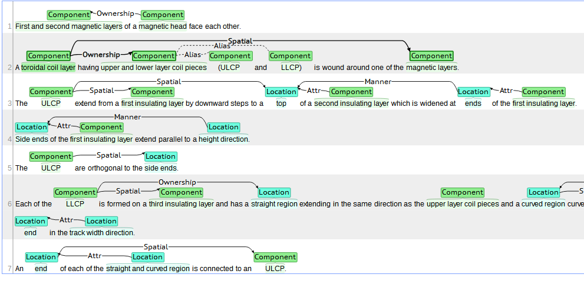
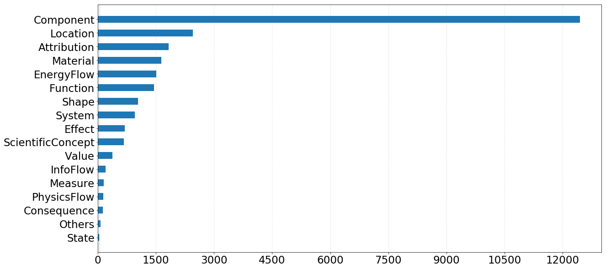
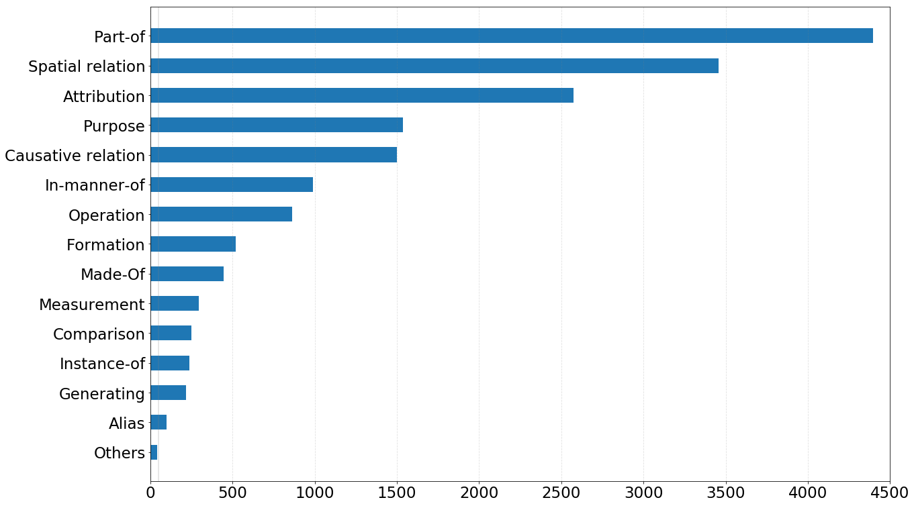
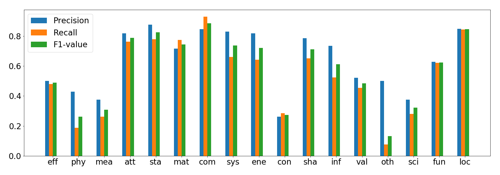
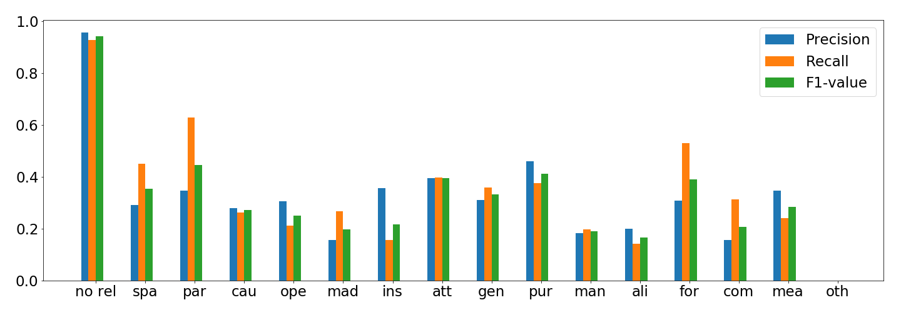

## **Dataset Introduction**
TFH_Annotated_Dataset is an annotated patent dataset pertaining to *thin film head* technology in hard-disk. To the best of our knowledge, this is the first labeled patent dataset public available in technology management domain that annotates both entities and the semantic relations between entities. 

The well-crafted information schema used for patent annotation contains 17 types of entities and 15 types of semantic relations as shown below.

**Table 1** The specification of entity types

| Type               | Comment                                     | example                                                      |
| ------------------ | ------------------------------------------- | :----------------------------------------------------------- |
| physical flow      | substance that flows freely                 | The **etchant solution** has a suitable solvent additive such as glycerol or methyl cellulose |
| information flow   | information data                            | A camera using a film having a magnetic surface for recording **magnetic data** thereon |
| energy flow        | entity relevant to energy                   | Conductor is utilized for producing **writing flux** in magnetic yoke |
| measurement        | method of measuring something               | The curing step takes place at the substrate **temperature** less than 200.degree |
| value              | numerical amount                            | The curing step takes place at the substrate temperature less than **200.degree** |
| location           | place or position                           | The legs are thinner near the pole tip than in the **back gap region** |
| state              | particular condition at a specific time     | The MR elements are biased to operate in a **magnetically unsaturated mode** |
| effect             | change caused an innovation                 | Magnetic disk system permits **accurate alignment** of magnetic head with spaced tracks |
| function           | manufacturing technique or activity         | A magnetic head having **highly efficient write and read functions** is thereby obtained |
| shape              | the external form or outline of something   | **Recess** is filled with non-magnetic material such as glass |
| component          | a part or element of a machine              | A pole face of **yoke** is adjacent edge of element remote from surface |
| attribution        | a quality or feature of something           | A **pole face** of yoke is adjacent edge of element remote from surface |
| consequence        | The result caused by something or activity  | This prevents the slider substrate from **electrostatic damage** |
| system             | a set of things working together as a whole | A **digital recording system** utilizing a magnetoresistive transducer in a magnetic recording head |
| material           | the matter from which a thing is made       | Interlayer may comprise material such as **Ta**              |
| scientific concept | terminology used in scientific theory       | **Peak intensity ratio** represents an amount hydrophilic radical |
| other              | Not belongs to the above entity types       | **Pressure distribution** across air bearing surface is substantially symmetrical side |

**Table 2** The specification of relation types

| TYPE               | COMMENT                                                     | EXAMPLE                                                      |
| ------------------ | ----------------------------------------------------------- | ------------------------------------------------------------ |
| spatial relation   | specify how one entity is located in **relation** to others | **Gap spacer material** is then deposited on the **film knife-edge** |
| part-of            | the ownership between two entities                          | a **magnetic head** has a **magnetoresistive element**       |
| causative relation | one entity operates as a cause of the other entity          | **Pressure pad** carried another **arm** of spring urges film into contact with head |
| operation          | specify the relation between an activity and its object     | **Heat treatment** improves the (100) **orientation**        |
| made-of            | one entity is the material for making the other entity      | The thin film head includes a **substrate** of **electrically insulative material** |
| instance-of        | the relation between a class and its instance               | At least one of the **magnetic layer** is a **free layer**   |
| attribution        | one entity is an attribution of the other entity            | The **thin film** has very high **heat resistance** of remaining stable at 700.degree |
| generating         | one entity generates another entity                         | **Buffer layer resistor** create **impedance** that noise introduced to head from disk of drive |
| purpose            | relation between reason/result                              | **conductor** is utilized for producing **writing flux** in magnetic yoke |
| in-manner-of       | do something in certain way                                 | The **linear array** is angled at a **skew angle**           |
| alias              | one entity is also known under another entity’s name        | The bias structure includes an **antiferromagnetic layer** **AFM** |
| formation          | an entity acts as a role of the other entity                | **Windings** are joined at end to form **center tapped winding** |
| comparison         | compare one entity to the other                             | **First end** is closer to recording media use than **second end** |
| measurement        | one entity acts as a way to measure the other entity        | This provides a relative **permeance** of at least **1000**  |
| other              | not belongs to the above types                              | Then, **MR resistance estimate** during polishing step is calculated from **S value** and K value |

There are 1010 patent abstracts in this corpus, which contain 3,981 sentences. We use a web-based annotation tool named *Brat*[1] for data labeling, and the annotated data is saved in '.ann' format. The benefit it brings is that you can display and manipulate the annotated data right away once TFH_Annotated_Dataset.zip is unzipped and placed in the corresponding repository of Brat, as shown in Fig. 1.

**Fig. 1** The demo of TFH_Annotated_Dataset

TFH_Annotated_Dataset contains 22,742 entity mentions and 17,421 semantic relation mentions. The statistics of entity and semantic relation types are illustrated in Fig. 2 and Fig. 3, respectively. 

**Fig. 2** The distribution of different semantic relation types.

**Fig. 3** The distribution of different semantic relation types.

## **Information extraction results with deep learning models**
With TFH_Annotated_Dataset, we run two tasks of information extraction including named entity recognition  with BiLSTM-CRF[2] and semantic relation extractionand with BiGRU-2ATTENTION[3]. For improving semantic representation of patent language, the word embeddings are trained with the abstract of 46,302 patents regarding magnetic head in hard disk drive, which  turn out to improve the performance of  named entity recognition by 0.3% and semantic relation extraction by about 2% in weighted average F1, compared to GloVe and the patent word embedding provided by Risch et al[4].

For named entity recognition, the weighted-average precision, recall, F1-value of BiLSTM-CRF on entity-level for the test set are 78.5%, 78.0%, and 78.2%, respectively. Although such performance is acceptable, it is still lower than its performance on general-purpose dataset by more than 10% in F1-value. The main reason is the limited amount of labeled dataset. 

The precision, recall, and F1-value for each type of entity is shown in Fig. 4.

**Fig.4** Result of BiLSTM-CRF for named entity recognition.

As to relation extraction,  the weighted-average precision, recall, F1-value of BiGRU-2ATTENTION for the test set are 78.5%, 78.0%, and 78.2% with no_edge relations, and 32.3%, 41.5%, 36.3% without no_edge relations. 

The precision, recall, and F1-value for each type of relation is shown in Fig. 5.

**Fig. 5** Result of BiGRU-HAN for semantic relation extraction.

The relevant paper will be published soon, welcome to use TFH annotated dataset and cite our paper!

## **REFERENCE**
[1] Stenetorp, P., Pyysalo, S., Topić, G., Ohta, T., Ananiadou, S., & Tsujii, J. I. (2012). BRAT: a web-based tool for NLP-assisted text annotation. In Proceedings of the Demonstrations at the 13th Conference of the European Chapter of the Association for Computational Linguistics (pp. 102-107)

[2] Huang, Z., Xu, W., &Yu, K. (2015). Bidirectional LSTM-CRF models for sequence tagging. arXiv preprint arXiv:1508.01991

[3] Han,X., Gao,T., Yao,Y., Ye,D., Liu,Z., Sun, M.(2019). OpenNRE: An Open and Extensible Toolkit for Neural Relation Extraction. arXiv preprint arXiv: 1301.3781

[4] Risch, J., & Krestel, R. (2019). Domain-specific word embeddings for patent classification. Data Technologies and Applications, 53(1), 108–122. 
